# Progression

Visual version history for procgen_maps. Each entry shows what the generator
actually produced at that point — screenshots and renders, not just commit
messages. Presets/seeds are noted so any image can be reproduced exactly.

---

## v0.6.0 — Special buildings: supermarket, police station, hospital, fire station, school (current)

Five unique, zone-targeted building types beyond the 12 generic facades,
placed by explicit selection logic (`generators/city/special_buildings.py`)
rather than the random per-block facade pick `buildings.plan_buildings`
uses: each city gets one police station, hospital, fire station and school
(largest available block in an allowed zone), plus a supermarket every ~45
blocks (so bigger cities get more than one). Reuses `buildings.BuildingPlan`/
`FacadeType` directly - each special type is just a `FacadeType` with its
own fixed floor count/height and an extended material_index (12-16 in
`city_mat.py`'s facade color ramp) instead of a randomly rolled one, so the
exact same shell/window/roof/interior mesh construction applies unchanged.
`generate_city` now reserves each special building's block before handing
the rest to `plan_buildings`, so a block never gets both.

Every special building gets an illuminated sign - a real Blender Text
object mounted on the entrance facade, not a texture, so it's readable at
any render distance - plus, for hospitals specifically, a rooftop helipad
(a flat disc + a raised "H" marking). Furniture catalog
(`assets/library.py`) extended with per-type interior sets (hospital beds,
police desks, supermarket shelving/counters, etc.) for the ground-floor
interiors every building already gets.

New pytest coverage in `test_generators.py`: reserved-block/plan bookkeeping
is consistent, special buildings never land on park blocks or reuse a
regular building's block, `min_blocks_required` correctly gates small
cities out of types they're too small for, supermarket count scales with
city size, planning is deterministic for a given seed, and every spec has a
unique material index.

**Kleinstadt, seed 7 — hospital close-up (sign + rooftop helipad), with the neighboring police station and school also in frame:**
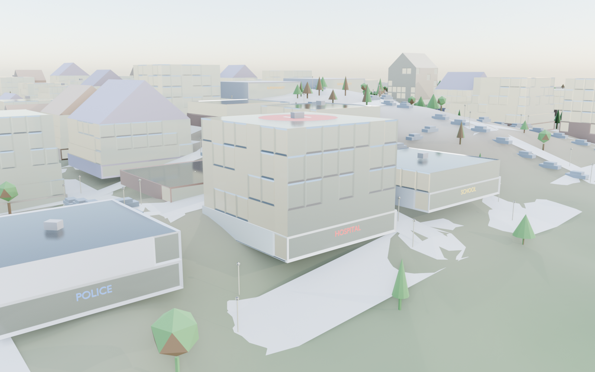

**Kleinstadt, seed 7 — supermarket close-up (two placed in this city, per the every-45-blocks scaling):**
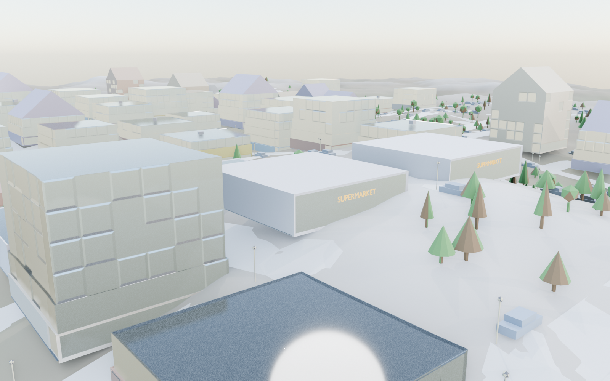

**Kleinstadt, seed 7 — full city overview:**
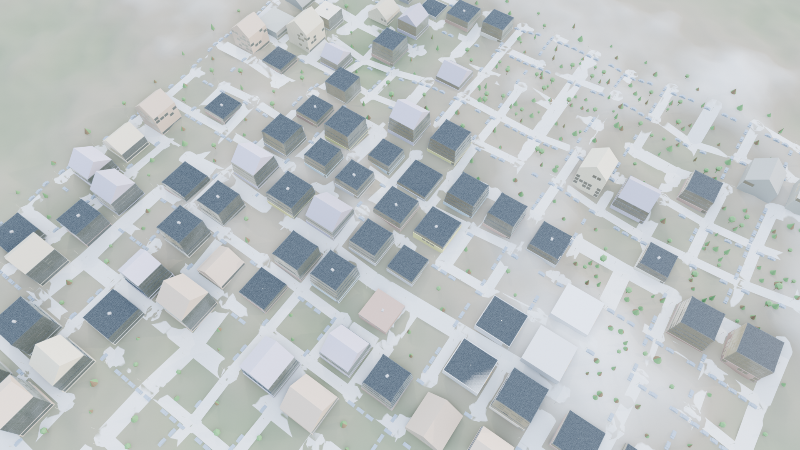

**Live Blender session — actual screenshot, N-panel open:**
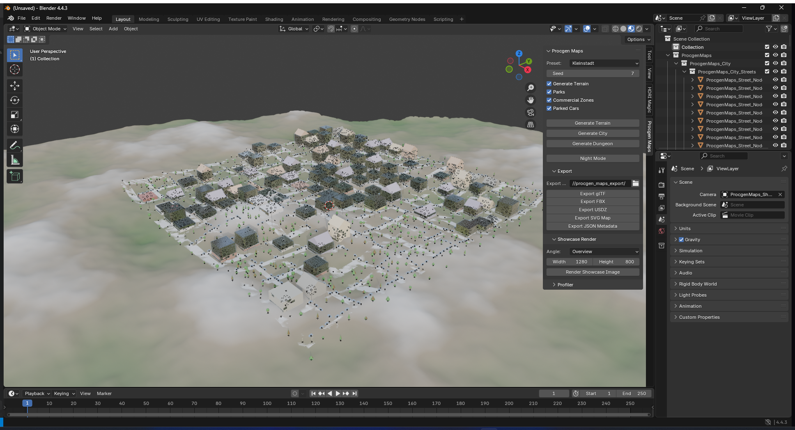

---

## v0.5.0 — New feature: "Render Showcase Image" tool

Every render/screenshot in this document up to now came from a one-off
Python script written by hand each time (bounding-box math, camera
placement, sun setup, EEVEE settings) - none of that lived in the addon
itself. This turns it into a real, reusable feature: a new `rendering/`
subsystem (`framing.py`, pure-Python bounding-box-to-camera-placement math,
fully pytest-covered; `showcase.py`, the bpy build step that creates the
camera/sun and configures+triggers the render) plus a **Render Showcase
Image** button in a new N-panel section, with an angle dropdown (Overview /
Close-up / Low Angle) and a resolution field. One click auto-frames a
camera on whatever's been generated, sets up sun position for day/night,
turns on raytracing for correct glass transmission, and renders straight to
the export directory - no more hand-tuning a script per screenshot. This is
meant to keep improving over future rounds (more angle presets, depth of
field, compositor-based color grading, etc.).

**Kleinstadt, seed 12 — produced by clicking the actual button (well, calling the same operator the button calls):**
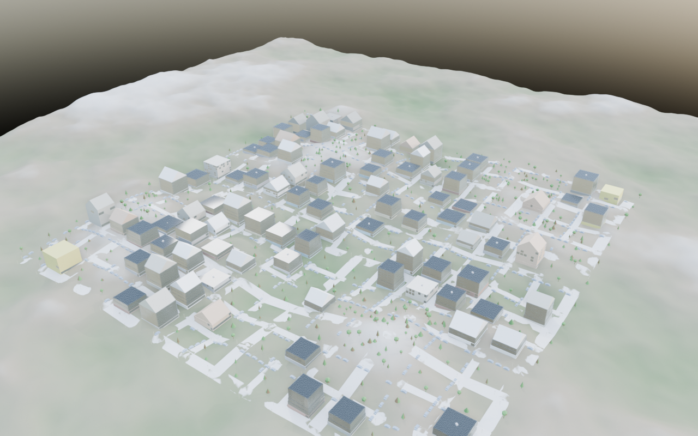

**Live Blender session, N-panel open (Procgen Maps tab visible in the sidebar):**
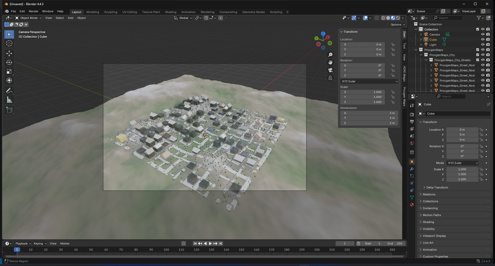

---

## v0.4.0 — Procedural sky + facade/terrain material detail for higher-quality rendering

First rendering-quality pass (materials only - no new generator logic).
Every `generate_terrain` call now sets up a real Nishita procedural sky
world (`materials/world_mat.py`) instead of a flat background color, so
renders get physically-based sky gradient, sun, and ambient lighting for
free; night mode dips the same sky's sun below the horizon rather than
swapping to a separate flat-color night world. The city facade material
mixes in an Object-space noise "grain" (stable per building, not flickering
with world position) on top of the flat per-facade color, plus a matching
Bump for micro-surface detail - and the terrain material got the same
treatment (speckle noise breaking up the flat height-band colors, finer
noise driving its own bump). All purely procedural shading tricks - no
image textures, no extra geometry/subdivision - consistent with the
addon's no-baked-assets approach everywhere else.

**Kleinstadt, seed 8 — rendered, raytracing on:**
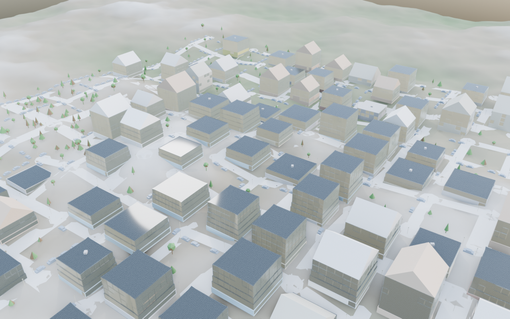

**Live Blender session — actual screenshot, grain clearly visible on facades:**
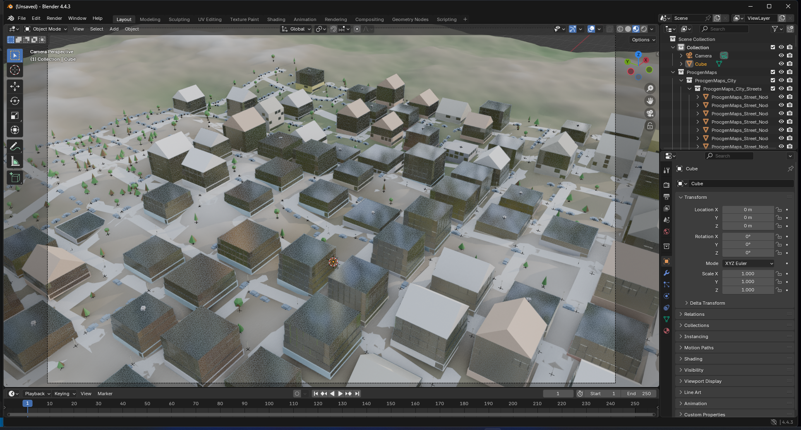

---

## v0.3.1 — Fixed remaining block/building overlaps in raster-mode presets

A live-session screenshot on Metropole showed buildings visibly overlapping
each other - a bug the v0.3.0 prop/building overlap fix didn't cover, since
that fix only kept *props* out of buildings, not buildings out of each
other. Root cause: raster-mode blocks (Metropole, Industrial) are built
from the axis-aligned bounding box of an irregular Voronoi-like cell, and
for non-convex or oddly-shaped cells that bbox can still extend into a
neighboring seed's actual territory even after the existing fill-factor
shrink - so two blocks (and the buildings placed on them) could overlap.
Grid-mode presets (Dorf, Kleinstadt) were never affected. Measured 156
overlapping block pairs / 41 overlapping buildings on Metropole and 37 / 11
on Industrial before the fix.

Rather than trying to reconstruct the true (possibly concave) cell polygon
just for a tighter initial estimate, `generate_layout` now resolves the
*invariant* directly: any pair of blocks whose rectangles still overlap
gets shrunk along whichever axis has the smaller overlap until their
projections on that axis no longer intersect, which by the AABB
separating-axis test guarantees no overlap regardless of the other axis.
A few passes settle chains of mutually-touching blocks. Blocks shrunk down
to a sliver by this process are dropped. Verified 0 block and 0 building
overlaps across all 4 presets, with a regression test added.

**Metropole, seed 1 — rendered (raytracing enabled, no more transmission ghosting either):**
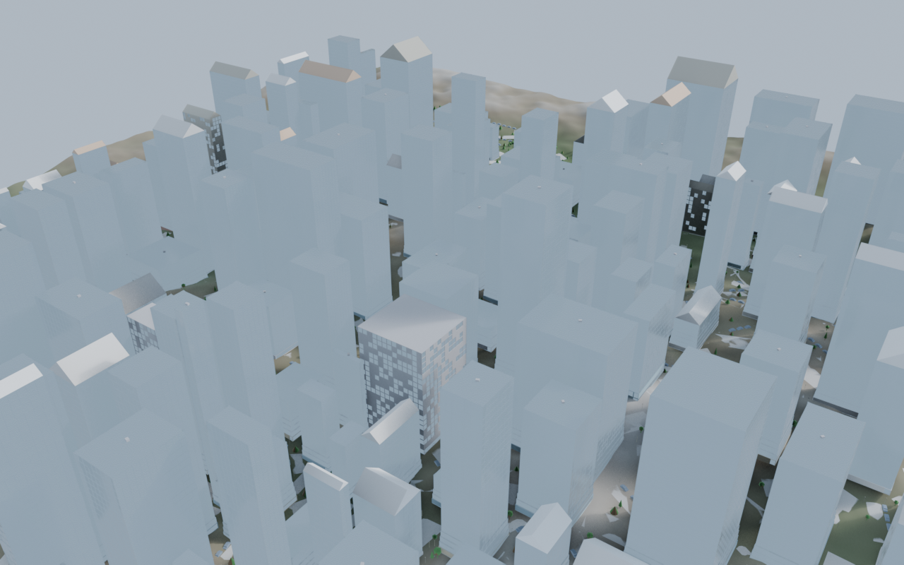

**Live Blender session — actual screenshot:**
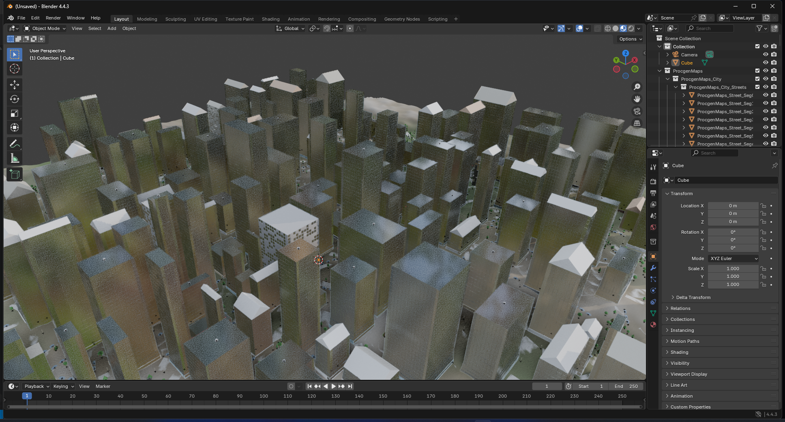

---

## v0.3.0 — Detail pass, ground-floor interiors, overlap fix

Building facades got real per-instance variety (jittered window frequency/
pitch/floor height so same-facade buildings stop looking identical), a
proper wide entrance recess on the ground floor, and a chance at a rooftop
utility unit on flat-roofed buildings. Every building now gets a simple
furnished ground-floor interior (floor, ceiling, warm light, 2-3
facade-appropriate furniture pieces from a new catalog) visible through
actually-transmissive window glass. Also fixed two real bugs surfaced by
this pass: props could still spawn overlapping buildings in the denser
raster-layout presets (Metropole, Industrial) because `SpatialHashGrid`'s
collision search radius didn't account for large registered items (like a
building's bounding circle) — only the query's own small radius. Verified
0 overlaps across all 4 presets after the fix, with a regression test
locking it in.

**Kleinstadt, seed 21 — rendered:**
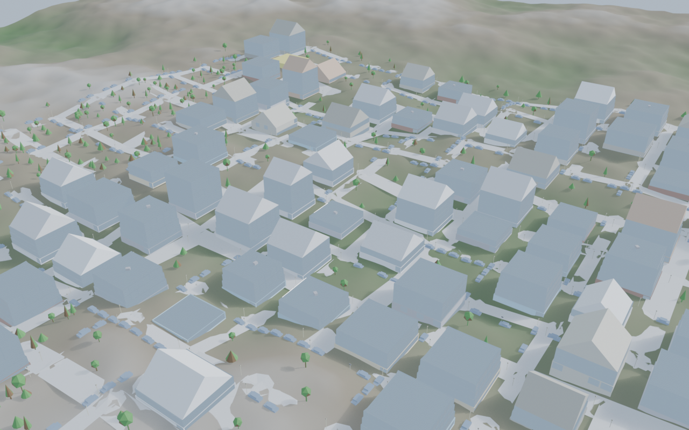

**Live Blender session — actual screenshot, not a render:**
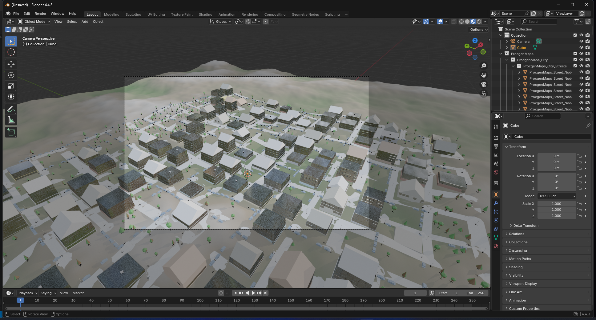

**Dorf, seed 30 — rendered:**
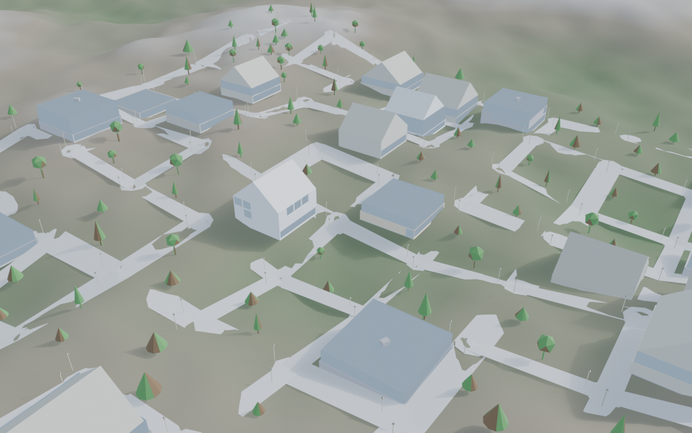

**Kleinstadt, seed 30, night mode:**
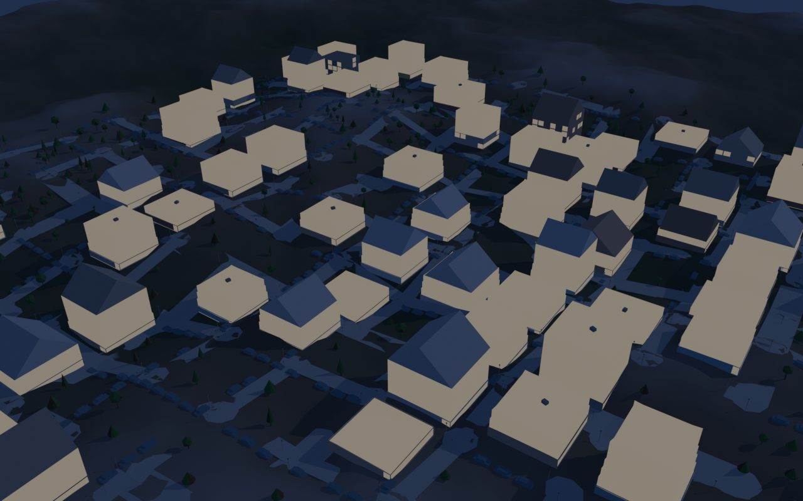

---

## v0.2.0 — Core bug fixes: grounded props, real materials, working windows/roofs

Fixed the issues visible in the first end-to-end test: props (trees, lamps,
benches) were floating above or buried under sloped terrain because
`props.py` hardcoded z=0 instead of sampling the heightmap; nothing had a
real material assigned (props showed as flat gray, and Blender's Solid
viewport shading ignores shader node graphs entirely, reading a separate
`diffuse_color` field instead); and — the deepest bug of this round —
window/roof detail had never actually rendered because of a `bmesh` quirk:
`extrude_face_region`'s own return value only reports the single moved top
face and silently drops the 4 newly-created side faces every time, so the
window-carving code had been running against nothing since it was written.
Fixed with a proper before/after face diff, added a real gable roof (ridge +
two slopes, not a single-point pyramid poke), and nested `ProcgenMaps_City`
correctly under the addon's root collection instead of as a stray sibling.

**Dorf, seed 7:**
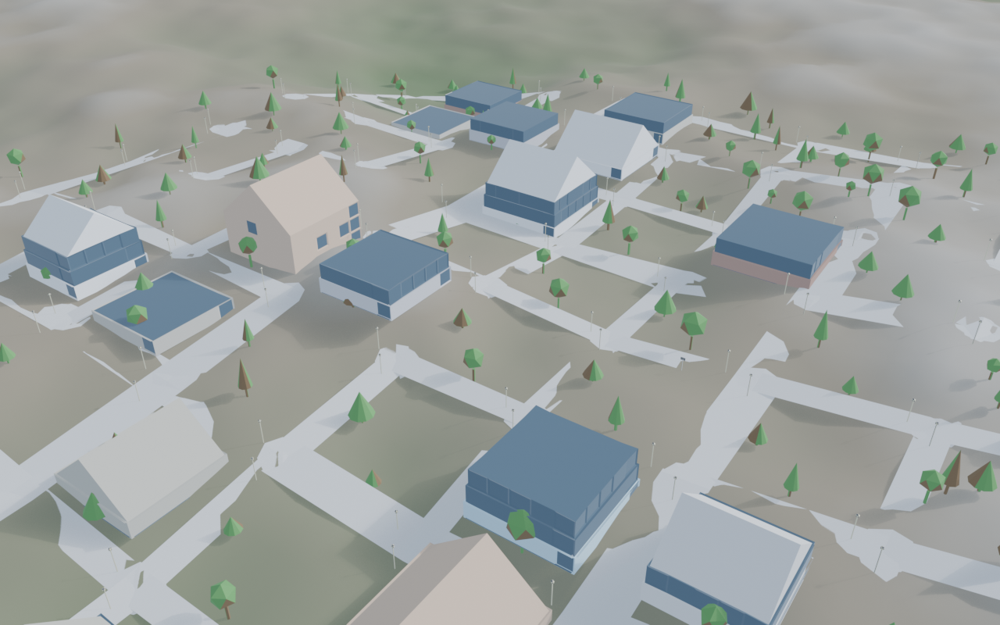

**Metropole, seed 1:**
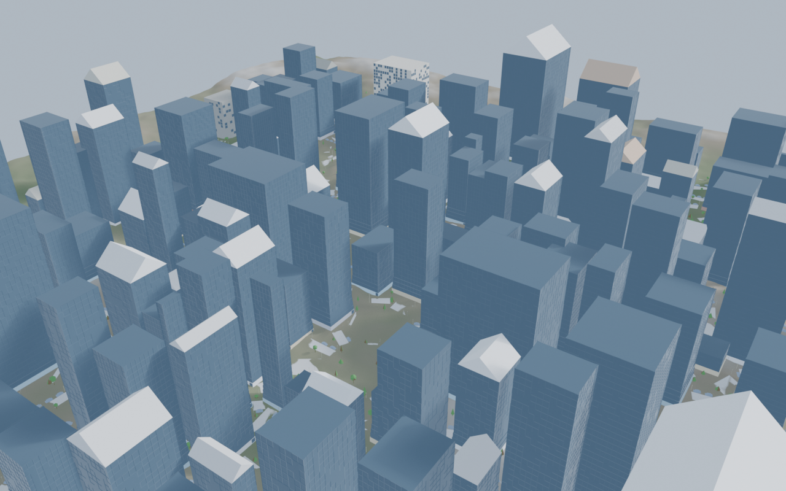

---

## v0.1.0 — Initial functional build

First end-to-end pass: 4 presets, terrain, the full layout → zones → streets
→ buildings → props pipeline, a BSP dungeon generator, and glTF/FBX/USDZ/
SVG/JSON export, all verified via a headless Blender smoke test. Visually
rough: props floating/buried relative to terrain, flat gray materials, and
buildings that were plain extruded boxes with no visible window or roof
detail — the issues v0.2.0 above fixes. No image captured for this
milestone (issues were reported via a live screenshot in conversation,
not saved to a file at the time).

---

## Reproducing any of these

```
blender --background --factory-startup --python your_script.py
```
```python
import procgen_maps
procgen_maps.register()
bpy.context.scene.procgen_maps.preset = "KLEINSTADT"  # or DORF / METROPOLE / INDUSTRIAL
bpy.context.scene.procgen_maps.seed = 21
bpy.ops.procgen_maps.generate_terrain()
bpy.ops.procgen_maps.generate_city()
```
See DEPLOYMENT.md for the full headless workflow.
